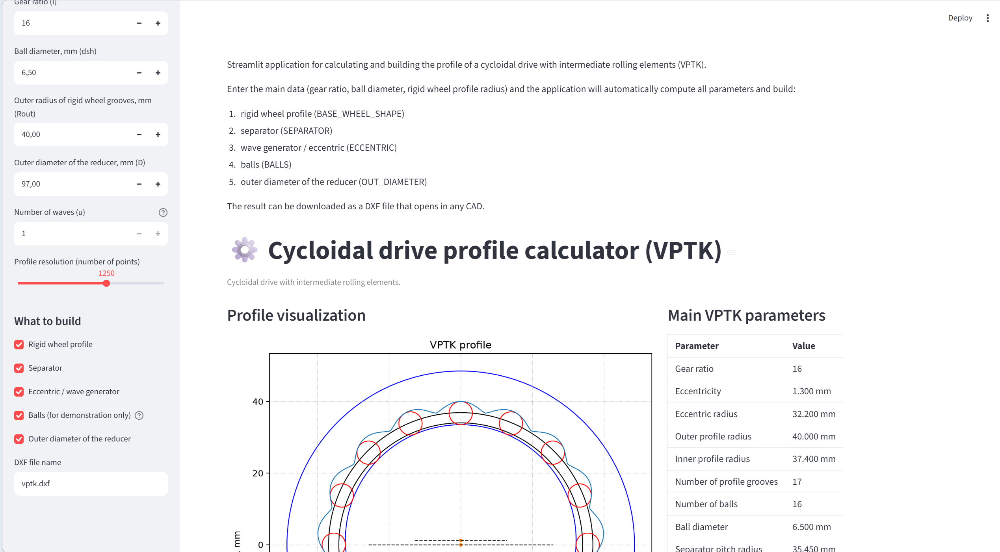

# Cycloidal Drive Profile Calculator (VPTK)

A [Streamlit](https://streamlit.io/) application for calculating and visualizing the profile of a **cycloidal drive with intermediate rolling elements** (also known as VPTK — *Volnovoy Reduktor s Promezhutochnymi Telami Kacheniya*).

## Features

- Computes the full geometry of a cycloidal drive: rigid wheel profile, separator, eccentric (wave generator), balls, and outer diameter.
- Interactive visualization using Matplotlib.
- Parameter table with all computed values.
- Export the drawing to **DXF** format (compatible with any CAD software).
- Toggle individual elements on/off in the plot and DXF output.

## Screenshots

*(Add a screenshot here)*

## Installation

### Prerequisites

- Python 3.9+
- pip

### Setup

Run the installation script:

```batch
install.bat
```

This will create a virtual environment and install all dependencies.

Or manually:

```batch
python -m venv venv
venv\Scripts\activate
pip install -r requirements.txt
```

## Usage

### Russian version

```batch
start.bat
```

Launches the app on `http://localhost:8501` using `app.py` (Russian interface).

### English version

```batch
start_en.bat
```

Launches the app on `http://localhost:8502` using `app_en.py` (English interface).

### Input parameters

| Parameter | Description |
|-----------|-------------|
| **Gear ratio (i)** | Number of teeth / balls (2–200) |
| **Ball diameter (dsh)** | Diameter of rolling elements in mm |
| **Outer radius of rigid wheel grooves (Rout)** | In mm |
| **Outer diameter of the reducer (D)** | In mm |
| **Number of waves (u)** | Leave at 1 (values >1 are not verified) |
| **Profile resolution** | Number of points used to compute the profile |

### Drawable elements

- Rigid wheel profile
- Separator (inner & outer circles)
- Eccentric / wave generator
- Balls (for demonstration only)
- Outer diameter of the reducer

## Project structure

```
calculator/
├── app.py            # Streamlit app (Russian)
├── app_en.py         # Streamlit app (English)
├── requirements.txt  # Python dependencies
├── install.bat       # Setup script
├── start.bat         # Launch Russian version
├── start_en.bat      # Launch English version
├── .gitignore
└── venv/             # Virtual environment (generated)
```

## Dependencies

- [streamlit](https://streamlit.io/) — web UI framework
- [numpy](https://numpy.org/) — numerical computations
- [matplotlib](https://matplotlib.org/) — plotting
- [ezdxf](https://ezdxf.readthedocs.io/) — DXF file generation

## Versions

The calculator is available in two language versions:
- **Russian** — `app.py` (launched via `start.bat`)
- **English** — `app_en.py` (launched via `start_en.bat`)

## License

This project is for educational and engineering use. No license specified.
